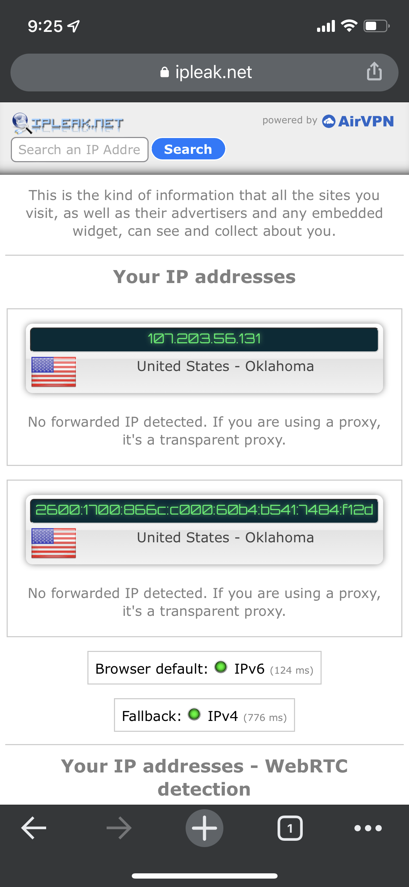
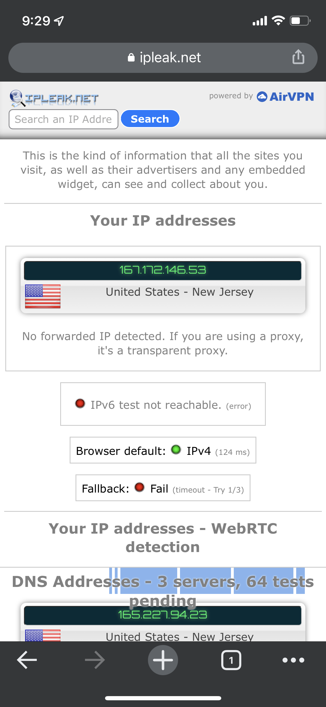
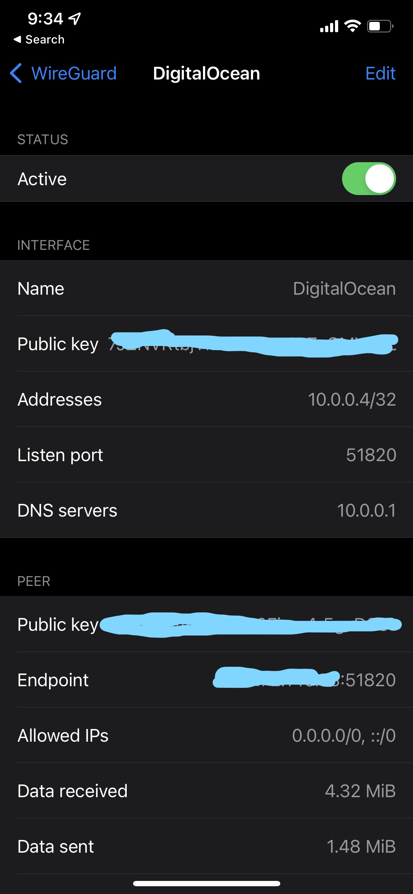
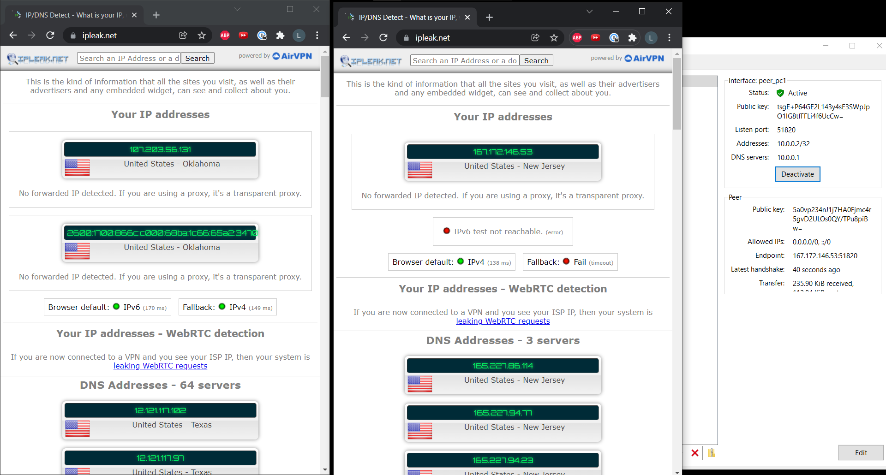

# VPN-Docker Project

## Install Docker on Droplet
1. Access your droplet from the console on the Digital Ocean website or ssh into it.

2. Install Docker:
```
sudo apt update
sudo apt install docker.io
```

3. Install Docker Compose:
```
sudo curl -L "https://github.com/docker/compose/releases/download/1.27.4/docker-compose-$(uname -s)-$(uname -m)" -o /usr/local/bin/docker-compose

sudo chmod +x /usr/local/bin/docker-compose
```

## Install Wireguard 
1. Run the following commands:
~~~
mkdir -p ~/wireguard/
mkdir -p ~/wireguard/config/
nano ~/wireguard/docker-compose.yml
~~~

2. Enter the following into docker-compose.yml:
~~~
version: '3.8'
services:
  wireguard:
    container_name: wireguard
    image: linuxserver/wireguard
    environment:
      - PUID=1000
      - PGID=1000
      - TZ=US/Central
      - SERVERURL=167.172.146.53
      - SERVERPORT=51820
      - PEERS=pc1,pc2,phone1
      - PEERDNS=auto
      - INTERNAL_SUBNET=10.0.0.0
    ports:
      - 51820:51820/udp
    volumes:
      - type: bind
        source: ./config/
        target: /config/
      - type: bind
        source: /lib/modules
        target: /lib/modules
    restart: always
    cap_add:
      - NET_ADMIN
      - SYS_MODULE
    sysctls:
      - net.ipv4.conf.all.src_valid_mark=1
~~~
- `TZ` is your timezone and `SERVERURL` is your server IP address. Change these as needed.

3. Start Wireguard:
~~~
cd ~/wireguard/
docker-compose up -d
~~~

## Test your VPN on a mobile device
1. Install the Wireguard app on your phone.
2. Generate a QR code so you can setup the mobile app:
~~~
docker-compose logs wireguard
~~~
3. Scan the QR with the app to setup the VPN.







## Test your VPN on a Laptop
1. Find one of your user config files and copy it to your laptop.
~~~
cd ~/wireguard/config/{username}
~~~
2. Install the Wireguard app on your laptop.
3. Open the app and setup a new VPN with the config file you just copied.



